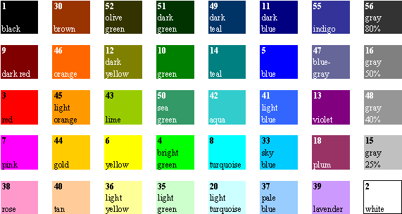

- [Excel Tutorial for Beginners](https://www.youtube.com/watch?v=LgXzzu68j7M)
- [Excel Charts and Graphs Tutorial](https://www.youtube.com/watch?v=eHtZrIb0oWY)
- [50 things you didn't know Excel can Do](https://www.youtube.com/watch?v=Tzuk3NH_u3I)
- [Build Impressive Charts: It's NOT your usual Bar Chart (Infographics in Excel)](https://www.youtube.com/watch?v=8g9DK5noi1s)
- [You Won't Believe These Crazy PIVOT TABLE Hacks!](https://www.youtube.com/watch?v=ZZRl7fALdjw)
- [Create an Excel Dashboard to Easily Track Budget and Actuals with Variances](https://www.youtube.com/watch?v=lHk6MdGAfw8)
- [Make Beautiful Excel Charts Like The Economist (file included)](https://www.youtube.com/watch?v=wP8NWRR0Fdg)
- [20 Excel Shortcuts to Save You HOURS of Work](https://www.youtube.com/watch?v=lfW8Z0KDpAI)
- [Introducing Python in Excel](https://www.youtube.com/watch?v=FbBXtqtRnWU)
- [High-Income Excel Skills Worth Learning in 2024 (Free File)](https://www.youtube.com/watch?v=McLQ3gEGbHQ)
- [McKinsey Charts with the REPT function](https://www.youtube.com/watch?v=-Pi68IkutaQ)

### colorIndex
for custom format use, e.g. index = 10: [color10] in German: [Farbe10]

